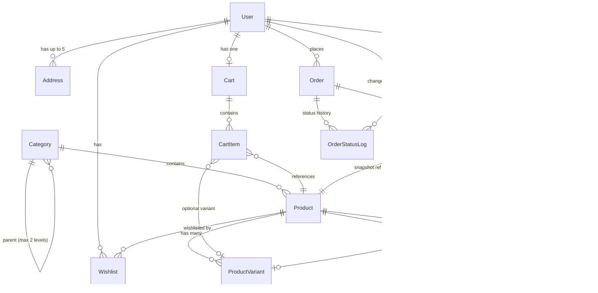
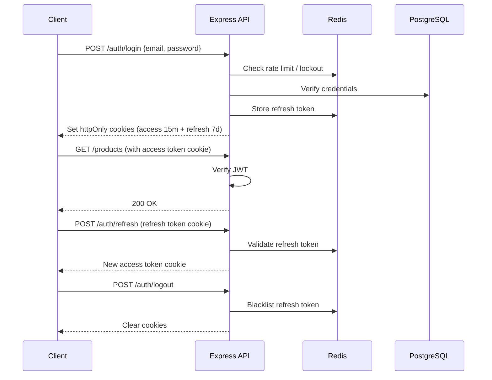
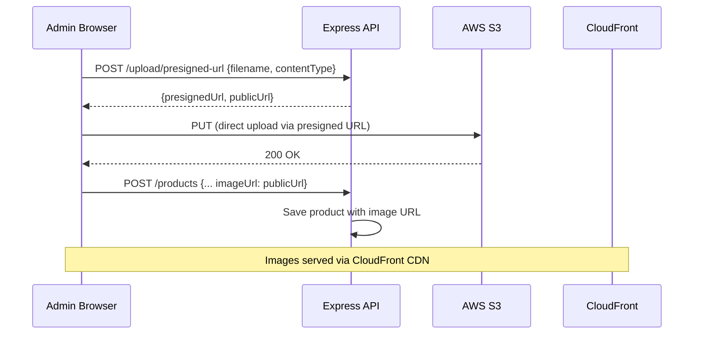
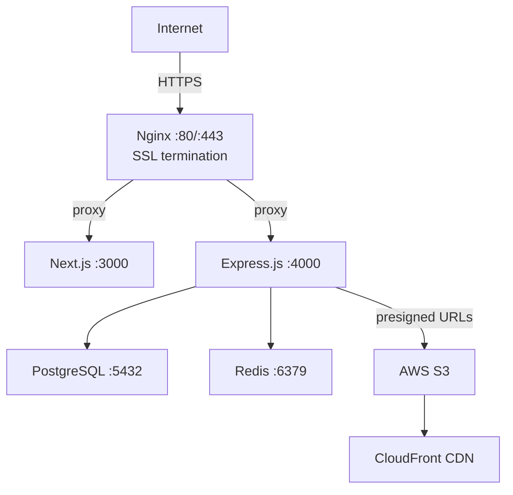

# Eshopy — Clarified Project Plan (v1)

> **Single source of truth** for all specification and implementation work.

Eshopy is a full-featured ecommerce web application where customers browse products, place orders, and pay online, and where administrators manage the entire operation from a back-office dashboard. The first version targets a single-region (US), single-currency (USD), small-scale deployment (~100 concurrent users).

---

## 1. Project Overview & Vision

**Goal**: Deliver a production-ready online store with a polished customer storefront, a multi-step Stripe-powered checkout, and a comprehensive admin dashboard — all in a single TypeScript monorepo.

**Key Principles**:
- End-to-end type safety (TypeScript strict mode everywhere)
- Shared validation schemas (Zod) between frontend and backend
- Soft-delete pattern — no permanent data destruction in v1
- Security by default — httpOnly JWT cookies, rate limiting, Helmet, input validation
- Small-scale first — single VPS deployment, designed for easy horizontal scaling later

---

## 2. User Personas & Stories

### 2.1 Personas

| Persona | Description | Access |
|---------|-------------|--------|
| **Guest Visitor** | Unauthenticated browser. Can browse catalog and build a localStorage cart. Must register/login to checkout, review, or access account features. | Storefront only |
| **Customer** | Registered user who shops, reviews, and manages their account. | Storefront + `/account` |
| **Administrator** | Internal staff managing catalog, orders, and users. Created initially via a database seed script. | Storefront + `/account` + `/admin` |

### 2.2 User Stories with Acceptance Criteria

#### Product Discovery

**US-1: Browse products by category**
- Categories displayed in sidebar/top navigation with product counts.
- Two-level nesting (e.g., "Electronics > Headphones").
- Clicking a category shows all products in it.

**US-2: Search for products**
- Search bar on every page; searches product name and description.
- Results ranked by relevance (PostgreSQL full-text search).
- Friendly "no results" message with suggestions when empty.

**US-3: Filter and sort product listings**
- Filters: price range, minimum star rating, in-stock only.
- Sort: price (low/high), newest arrivals, most popular (total units sold).
- Active filters shown as removable chips with "Clear all".
- Updates without full page reload (client-side filtering via React Query).

#### Product Details

**US-4: View product detail page**
- Image gallery with thumbnail navigation, full description, pricing, category breadcrumb, average rating, review count.
- Variant selection updates price and stock status.
- "Add to Cart" button; disabled when out of stock.

**US-5: View and submit product reviews**
- Reviews show: reviewer name, star rating (1–5), text, date.
- Rating distribution summary (1–5 stars) at top.
- Offset-paginated (default page size).
- Only authenticated verified purchasers can submit reviews.
- Published immediately (no moderation queue).
- Customers can edit/delete own reviews ("edited" label shown).
- Admins can delete any review.

#### User Accounts

**US-6: Register an account**
- Fields: email, password, first name, last name.
- Password: ≥8 characters, mix of letters and numbers, strength indicator.
- Auto-login after registration.

**US-7: Log in and log out**
- Email + password login.
- 5 failed attempts in 15 min → 30-minute lockout.
- "Forgot password?" → reset email (1-hour, single-use link).

**US-8: Manage account profile**
- Edit name and phone; email is read-only in v1.
- Up to 5 shipping addresses with labels, one marked default.
- Dashboard at `/account`: latest order, address count, wishlist count, profile completeness.

**US-9: Manage wishlist**
- Heart icon toggle on product cards and detail pages.
- Out-of-stock items stay with a label.
- Accessible from account area.

#### Shopping & Checkout

**US-10: Manage shopping cart**
- Variant must be selected before adding.
- Same product/variant increments quantity (no duplicates).
- Cart icon shows count; toast on add.
- Cart page: image, name, variant, unit price, quantity (capped at stock), line total, remove.
- Summary: subtotal, estimated tax, total.
- Empty cart → "Continue Shopping".
- Guest cart in localStorage; merges on login (higher quantity wins).

**US-11: Complete checkout** (multi-step, requires authentication)
1. Shipping address — saved or new (option to save).
2. Shipping method — Standard (5–7 days) / Express (2–3 days), fixed prices, cheapest pre-selected.
3. Payment — Stripe Elements card form, clear error + retry on failure.
4. Confirmation — order number, items, address, method, breakdown (subtotal, shipping, tax, total), estimated delivery.
- Stock validated at add-to-cart AND checkout; atomic decrement on payment.

**US-12: Tax calculation**
- Single flat configurable percentage rate (stored in `StoreSetting`).
- US only, USD only.

#### Post-Purchase

**US-13: View order history and details**
- List: order number, date, item count, total, color-coded status badge.
- Statuses: pending, paid, processing, shipped, delivered, cancelled, refunded.
- Detail: line items, shipping info, payment summary, status timeline, tracking number.

**US-14: Reorder from past orders**
- "Reorder" adds all available items (exact variants) back to cart.
- Unavailable items skipped with notification.

**US-15: Cancel an order**
- Available when status is "paid" or "processing".
- Triggers automatic Stripe refund; stock restored.

#### Admin — Dashboard

**US-16: View store performance**
- KPIs (last 30 days): total revenue, total orders, AOV, registered customer count.
- Daily revenue chart (Recharts).
- Top 5 best-selling products, 5 most recent orders.
- Data fetched on page load (no real-time updates).

#### Admin — Product Management

**US-17: Manage products**
- Table: thumbnail, name, category, base price, total stock, active/inactive.
- Search by name, filter by category/status, sort by name/price/date.
- Create/edit: name, auto-slug (editable), rich-text description, category, base price, active toggle.
- Images: up to 10 per product (5 MB each), drag-and-drop reorder, alt text, stored in S3.
- Flat variants: name, SKU, optional price override, stock quantity.
- Soft-delete only (deactivate hides from storefront, preserves in DB and orders).

#### Admin — Category Management

**US-18: Manage categories**
- Editable tree (max 2 levels).
- Create root/sub, edit name/slug/parent, drag-and-drop reorder.
- Cannot delete category with assigned products (must reassign first).
- Moving a product preserves reviews, ratings, order history.

#### Admin — Order Management

**US-19: Manage orders**
- Table: filter by status (multi-select) and date range.
- Detail: customer view + customer email + admin notes.
- Status transitions: paid → processing → shipped (tracking number required) → delivered.
- Refunds on any paid or completed order.
- Every status change logged with admin identity and timestamp.

#### Admin — User Management

**US-20: Manage user accounts**
- Table: email, name, role, registration date, order count, active status.
- Promote/demote roles (at least one admin must always exist).
- Deactivate/reactivate accounts (deactivated → forced logout on next request, data preserved).
- Admins can only change role and active status, not profile details.

---

## 3. Feature Breakdown with Priorities

### MVP (v1) — Must Have

| # | Feature | Priority |
|---|---------|----------|
| 1 | Product catalog browsing (2-level categories) | P0 |
| 2 | Product search (PostgreSQL full-text) | P0 |
| 3 | Filtering & sorting | P0 |
| 4 | Product detail pages (gallery, variants, stock) | P0 |
| 5 | Product variants (flat model) | P0 |
| 6 | User registration & login (JWT, lockout, password reset) | P0 |
| 7 | User profile & addresses | P1 |
| 8 | Shopping cart (guest + authenticated, merge) | P0 |
| 9 | Multi-step checkout (Stripe) | P0 |
| 10 | Flat tax calculation | P0 |
| 11 | Order management (customer) | P0 |
| 12 | Order cancellation & refund | P1 |
| 13 | Reorder | P2 |
| 14 | Product reviews | P1 |
| 15 | Wishlist | P2 |
| 16 | Admin dashboard (KPIs, charts) | P1 |
| 17 | Admin product management | P0 |
| 18 | Admin category management | P0 |
| 19 | Admin order management | P0 |
| 20 | Admin user management | P1 |
| 21 | Stock management (atomic decrement) | P0 |

### Explicitly Out of Scope for v1

- Social/OAuth login, 2FA, email verification
- Account deletion / GDPR export
- Product recommendations, comparison
- Multi-language, multi-currency
- Promo codes, coupons, discounts
- Saved payment methods, digital wallets
- Subscriptions, recurring orders
- Order editing after placement
- Third-party tax calculation
- Email notifications for order status
- Returns and exchanges
- Invoice/receipt PDF generation
- Customer-admin messaging
- Gift cards, store credit
- Bulk product import/export
- In-browser image cropping
- Low-stock alerts
- CMS / page content management
- Multi-level admin permissions

---

## 4. Data Model Overview



### Key Entities

| Entity | Key Fields | Notes |
|--------|-----------|-------|
| **User** | id, email (unique), password_hash, first_name, last_name, phone, role (customer\|admin), is_active | Soft-delete via is_active |
| **Address** | id, user_id (FK), label, street, city, state, zip_code, country, is_default | Max 5 per user |
| **Category** | id, parent_id (FK, nullable), name, slug (unique), sort_order | Max 2 nesting levels |
| **Product** | id, category_id (FK), name, slug (unique), description (rich text), base_price, is_active, total_units_sold | Soft-delete via is_active |
| **ProductImage** | id, product_id (FK), url, alt_text, sort_order | Cloud storage URL (S3 + CloudFront) |
| **ProductVariant** | id, product_id (FK), name, sku (unique), price_override (nullable), stock_quantity | Falls back to base_price if no override |
| **Review** | id, product_id (FK), user_id (FK), rating (1–5), text, is_edited | Only verified purchasers |
| **Wishlist** | user_id (FK), product_id (FK) | Join table |
| **Cart** | id, user_id (FK) | Server-side; guests use localStorage |
| **CartItem** | id, cart_id (FK), product_id (FK), variant_id (FK, nullable), quantity | |
| **Order** | id, user_id (FK), order_number (unique), status, shipping_address (snapshot), shipping_method, shipping_cost, subtotal, tax_amount, total, tracking_number, estimated_delivery_date, stripe_payment_intent_id, admin_notes | Address is a JSON snapshot, not FK |
| **OrderItem** | id, order_id (FK), product_id (FK), variant_id (FK, nullable), product_name, variant_name, unit_price, quantity, line_total | All price/name fields are snapshots |
| **OrderStatusLog** | id, order_id (FK), old_status, new_status, changed_by (FK), timestamp | Audit trail |
| **StoreSetting** | key, value, updated_at | tax_rate, standard_shipping_price, express_shipping_price |

### Key Design Decisions
- **Shipping address on orders**: Stored as a JSON snapshot (not a FK) so it survives address edits/deletes.
- **OrderItem snapshots**: Product name, variant name, and unit price are copied at order time so historical orders remain accurate.
- **Guest cart**: Lives in browser localStorage. Merged server-side on login/registration.

---

## 5. Technology Stack

### Core

| Layer | Technology | Version |
|-------|-----------|---------|
| Language | TypeScript (strict mode) | 5.x |
| Runtime | Node.js | 20 LTS |
| Backend framework | Express.js | 4.x |
| Frontend framework | Next.js (App Router) | 15 |
| UI library | React | 19 |
| Database | PostgreSQL | 16 |
| Cache / Rate limiting | Redis | 7 |
| ORM | Prisma | 6 |
| CSS | Tailwind CSS | 4 |
| State management | TanStack React Query v5 + React Context | |
| Monorepo | Turborepo + pnpm workspaces | |
| Package manager | pnpm | 9+ |

### Key Libraries

| Purpose | Library |
|---------|---------|
| Payment | Stripe Node SDK + Stripe.js + React Stripe Elements |
| Image upload | @aws-sdk/client-s3 (presigned URLs) |
| Rich text editor | TipTap or React Quill |
| Forms | React Hook Form + Zod |
| Validation | Zod (shared frontend/backend schemas) |
| Date handling | date-fns |
| Password hashing | bcrypt (12 salt rounds) |
| JWT | jsonwebtoken |
| Email | Nodemailer (SMTP provider) |
| Rate limiting | rate-limiter-flexible (Redis-backed) |
| Logging | pino |
| Charts | Recharts |
| Drag and drop | @dnd-kit |
| HTTP security | Helmet.js |
| XSS protection | DOMPurify (rich-text rendering) |
| Linting | ESLint |
| Formatting | Prettier |
| Git hooks | Husky + lint-staged |

---

## 6. Architecture

### Pattern: Monorepo Monolith

```
eshopy/
├── apps/
│   ├── web/                  # Next.js 15 frontend (storefront + admin)
│   │   ├── app/              # App Router pages
│   │   ├── components/       # React components
│   │   ├── hooks/            # Custom React hooks
│   │   ├── lib/              # Client utilities
│   │   └── styles/           # Global styles
│   └── api/                  # Express.js backend
│       ├── src/
│       │   ├── routes/       # REST route handlers
│       │   ├── controllers/  # Business logic
│       │   ├── middleware/   # Auth, validation, error handling
│       │   ├── services/     # External integrations (Stripe, S3, email)
│       │   └── utils/        # Shared utilities
│       └── prisma/
│           ├── schema.prisma
│           ├── migrations/
│           └── seed.ts
├── packages/
│   └── shared/               # Shared types, Zod schemas, constants
├── docker-compose.yml        # Dev: PostgreSQL, Redis, (optional) MinIO
├── docker-compose.prod.yml   # Production stack
├── Dockerfile                # Multi-stage production build
├── turbo.json                # Turborepo config
└── package.json              # Root workspace
```

### API Design

- **Pattern**: RESTful JSON API
- **Prefix**: `/api/v1/...`
- **Port**: API on `:4000`, frontend on `:3000`
- **Error format**:
  ```json
  {
    "error": {
      "code": "VALIDATION_ERROR",
      "message": "Human-readable message",
      "details": [{ "field": "email", "message": "Invalid email format" }]
    }
  }
  ```

### API Resource Groups

| Resource | Base Path |
|----------|-----------|
| Auth | `/api/v1/auth` |
| Users | `/api/v1/users` |
| Products | `/api/v1/products` |
| Categories | `/api/v1/categories` |
| Cart | `/api/v1/cart` |
| Orders | `/api/v1/orders` |
| Reviews | `/api/v1/products/:id/reviews` |
| Wishlist | `/api/v1/wishlist` |
| Admin | `/api/v1/admin/*` |
| Upload | `/api/v1/upload` |
| Settings | `/api/v1/settings` |

### Authentication Flow



### Image Upload Flow



---

## 7. Build, Test & Dev Commands

### Prerequisites
- Node.js 20 LTS
- pnpm 9+
- Docker & Docker Compose

### Development
```bash
pnpm install                              # Install all dependencies
docker compose up -d                      # Start PostgreSQL + Redis
pnpm --filter api prisma migrate dev      # Run DB migrations
pnpm --filter api prisma db seed          # Seed initial data
pnpm dev                                  # Start all apps (hot reload)
pnpm --filter api dev                     # Backend only
pnpm --filter web dev                     # Frontend only
```

### Build
```bash
pnpm build                    # Build all
pnpm --filter api build       # Build backend
pnpm --filter web build       # Build frontend
```

### Test
```bash
pnpm test                     # Unit + integration tests
pnpm test:watch               # Watch mode
pnpm test:coverage            # With coverage report
pnpm test:e2e                 # E2E tests (requires running dev env)
pnpm lint                     # ESLint
pnpm typecheck                # TypeScript type checking
```

### Production
```bash
docker compose -f docker-compose.prod.yml build   # Build production images
docker compose -f docker-compose.prod.yml up -d    # Start production stack
```

---

## 8. Deployment

### Target: Docker + VPS



**Components**:
- **Nginx**: Reverse proxy with Let's Encrypt SSL (certbot)
- **Next.js**: Frontend container (`next start`)
- **Express.js**: API container
- **PostgreSQL**: Container or managed DB
- **Redis**: Container or managed Redis
- **S3 + CloudFront**: Image storage and CDN

### CI/CD: GitHub Actions

- **On PR**: Lint → Typecheck → Unit/integration tests → Build
- **On merge to main**: All PR checks + E2E tests → Build Docker images → Push to registry → Deploy to VPS via SSH (rolling restart)

### Environment Variables

| Variable | Purpose |
|----------|---------|
| `DATABASE_URL` | PostgreSQL connection string |
| `REDIS_URL` | Redis connection string |
| `JWT_SECRET` | Access token signing secret |
| `JWT_REFRESH_SECRET` | Refresh token signing secret |
| `STRIPE_SECRET_KEY` | Stripe API secret |
| `STRIPE_PUBLISHABLE_KEY` | Stripe publishable key (frontend) |
| `STRIPE_WEBHOOK_SECRET` | Webhook signature verification |
| `AWS_ACCESS_KEY_ID` | S3 credentials |
| `AWS_SECRET_ACCESS_KEY` | S3 credentials |
| `AWS_S3_BUCKET` | S3 bucket name |
| `AWS_REGION` | AWS region |
| `CLOUDFRONT_URL` | CDN distribution URL |
| `SMTP_HOST` / `SMTP_PORT` / `SMTP_USER` / `SMTP_PASS` | Email config |
| `FRONTEND_URL` | Frontend origin (CORS, email links) |
| `NODE_ENV` | development / production / test |

---

## 9. Testing Strategy

### Unit Tests — Vitest
- **Scope**: Functions, utilities, Zod schemas, controllers, services.
- **Coverage target**: ≥80% line coverage for business logic.
- **Mocking**: Vitest built-in mocking (Prisma, Stripe, S3, Redis).
- **Location**: `*.test.ts` co-located with source.

### Integration Tests — Vitest + Supertest
- **Scope**: API endpoint testing with real test PostgreSQL (Docker).
- **Strategy**: Prisma setup/teardown; clean DB per test suite.
- **Key areas**: Auth flows, order lifecycle, stock atomicity.

### E2E Tests — Playwright
- **Scope**: Critical user journeys in browser.
- **Key flows**:
  - Guest → register → add to cart → checkout → confirmation
  - Login → search/filter → product page → review
  - Admin → product management → order transitions
- **Environment**: Full dev stack (frontend + API + DB + Redis).

### Quality Tools
- ESLint (TypeScript-aware rules)
- Prettier (formatting)
- Husky + lint-staged (pre-commit hooks)
- `pnpm audit` in CI (dependency security)

---

## 10. Non-Functional Requirements

### Performance (v1 Targets)

| Metric | Target |
|--------|--------|
| Concurrent users | ~100 |
| API response time (p95) | <500ms |
| Initial page load | <3s |
| Subsequent navigation | <1s |
| Max catalog size | ~10,000 products |
| Image upload limit | ≤5 MB per image |
| Images per product | ≤10 |

### Security
- HTTPS everywhere (TLS 1.2+)
- httpOnly, secure, sameSite=strict cookies
- bcrypt (12 rounds) password hashing
- Redis-backed rate limiting on auth endpoints
- Helmet.js security headers
- Zod validation on all API endpoints
- Prisma parameterized queries (no raw SQL)
- DOMPurify for rich-text rendering
- Stripe PCI compliance (card data never touches server)
- Stripe webhook signature verification
- CORS restricted to frontend origin
- Regular `pnpm audit` in CI

### Reliability
- Daily automated PostgreSQL backups (pg_dump or managed DB)
- Docker health checks on all containers
- Structured logging (pino)
- Graceful Express.js shutdown for zero-downtime deploys

### Pagination
- Offset-based pagination throughout
- Product listings: 20 items per page
- Admin tables: 25 rows per page

---

## 11. Scope Boundaries

### In Scope
- Single-region (US) ecommerce store, USD pricing
- Two roles: Customer and Admin (equal admin permissions)
- Stripe as sole payment processor
- AWS S3 + CloudFront for product images
- Flat configurable tax rate
- Fixed shipping rates (Standard / Express)
- Guest browsing and cart with merge-on-login
- Soft-delete for products and user accounts
- Database seed script for initial admin + sample data

### Out of Scope
- Mobile native apps (web only)
- Real-time features (WebSockets, live dashboards)
- Third-party integrations beyond Stripe
- Multi-tenant / marketplace
- Advanced inventory management
- Analytics beyond admin dashboard KPIs
- All items listed in "Explicitly Out of Scope for v1" (Section 3)
